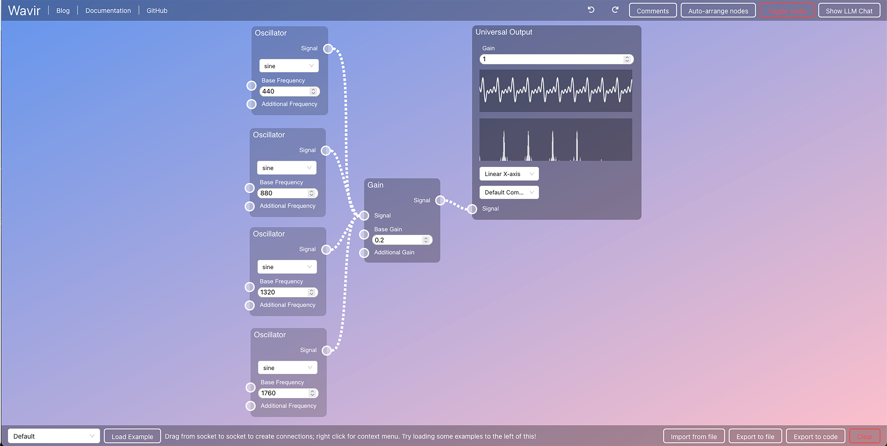

# Visual-Audio-Programming-Example-Code

## Normal MaxPy code for Additive synthesis

```python
# MaxPy example
import maxpy as mp

p = mp.MaxPatch()

fundamental = p.place("cycle~ 440", num_objs=1, starting_pos=[0, 100])[0]
partial1 = p.place("cycle~ 880", num_objs=1, starting_pos=[0, 150])[0]
partial2 = p.place("cycle~ 1320", num_objs=1, starting_pos=[100, 150])[0]
partial3 = p.place("cycle~ 1760", num_objs=1, starting_pos=[200, 150])[0]

mix = p.place("*~ 0.2", num_objs=5, starting_pos=[250, 300])
ez = p.place("ezdac~", num_objs=1, starting_pos=[150, 400])[0]

p.connect([fundamental.outs[0], mix[0].ins[0]])
p.connect([partial1.outs[0], mix[1].ins[0]])
p.connect([partial2.outs[0], mix[2].ins[0]])
p.connect([partial3.outs[0], mix[3].ins[0]])

p.connect([mix[0].ins[0], ez.ins[0]])
p.connect([mix[0].ins[0], ez.ins[1]])
p.connect([mix[1].ins[0], ez.ins[0]])
p.connect([mix[1].ins[0], ez.ins[1]])
# ...
p.save("additive.maxpat")
```

## Rich MaxPy code for Additive synthesis

```python
# Rich MaxPy example
import maxpy as mp
import random

p = mp.MaxPatch()

fundamental = 440
f = p.place(f"cycle~ {fundamental}", num_objs=1, starting_pos=[100, 100])[0]

num_partials = 3
partials = []
for i in range(1, num_partials + 1):
    multiplier = i + random.random()
    partial_freq = fundamental * multiplier
    partial = p.place(f"cycle~ {partial_freq}", num_objs=1, starting_pos=[100 + i*50, 100 + i*50])[0]
    partials.append(partial)

mix = p.place("*~ 0.2", num_objs=1, starting_pos=[300, 300])[0]
ez = p.place("ezdac~", num_objs=1, starting_pos=[400, 300])[0]

p.connect([f.outs[0], mix.ins[0]])
for partial in partials:
    p.connect([partial.outs[0], mix.ins[0]])

p.connect([mix.outs[0], dac.ins[0]])
p.connect([mix.outs[0], dac.ins[1]])

p.save("additive.maxpat")
```

## Web Audio API code example for Additive synthesis
```javascript
// Web Audio API code example
const audioCtx = new (window.AudioContext || window.webkitAudioContext)();

const osc1 = audioCtx.createOscillator();
const osc2 = audioCtx.createOscillator();
const osc3 = audioCtx.createOscillator();
const osc4 = audioCtx.createOscillator();

osc1.frequency.setValueAtTime(440, audioCtx.currentTime); 
osc2.frequency.setValueAtTime(880, audioCtx.currentTime); 
osc3.frequency.setValueAtTime(1320, audioCtx.currentTime);
osc4.frequency.setValueAtTime(1760, audioCtx.currentTime);

const gainNode = audioCtx.createGain();
gainNode.gain.setValueAtTime(0.5, audioCtx.currentTime); 

osc1.connect(gainNode);
osc2.connect(gainNode);
osc3.connect(gainNode);
osc4.connect(gainNode);

gainNode.connect(audioCtx.destination);

osc1.start();
osc2.start();
osc3.start();
osc4.start();
```

## Web Audio API rich code example for Additive synthesis
```javascript
// Web Audio API rich code example
const audioCtx = new AudioContext();

const fundamental = 440;
const nPartials = 3;

const masterGain = audioCtx.createGain();
masterGain.gain.setValueAtTime(0.3, audioCtx.currentTime); // Avoid clipping
masterGain.connect(audioCtx.destination);

for (let i = 0; i <= nPartials; i++) {
    const osc = audioCtx.createOscillator();
    
    if (i === 0) {
        osc.frequency.value = fundamental;
    } else {
        const randomMultiplier = 1 + Math.random() * 2;
        osc.frequency.value = fundamental * (i * randomMultiplier);
    }
    
    osc.connect(audioCtx.destination);
    oscs.push(osc);
    
    const gainNode = audioCtx.createGain();
    osc.connect(gainNode);
    gainNode.connect(masterGain);
    
    osc.start();
}
```

## Wavir example for Additive synthesis


